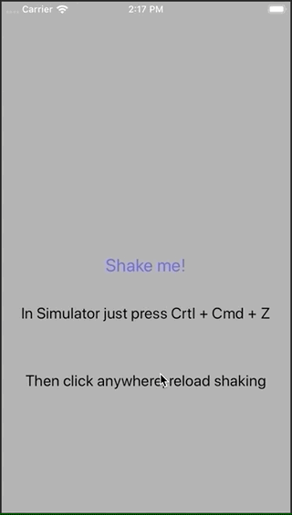

#  Physics Demo

This is a little demo of what you can do just using UIKit and its Physics API. You can add gravity to UI components, make them collide, etc.

## How's done?

In this case I'm:

- splitting a string into pieces
- creating a new UILabel for each one of those
- adding some properties, so they respond to "gravity" and they can collide
- showing them all in a transparent modal controller, so all appears on top of your current ViewController
- you can launch the demo shaking the device (in Simulator just press Cmd + Ctrl + Z)
- dismiss the demo just swiping down (it's a regular iOS 13 Modal ViewController)

## Installation

To get all this in your project, just drop `PhysicEffectsViewController.swift` in your Project and you're done. Edit and customize to your needs!

